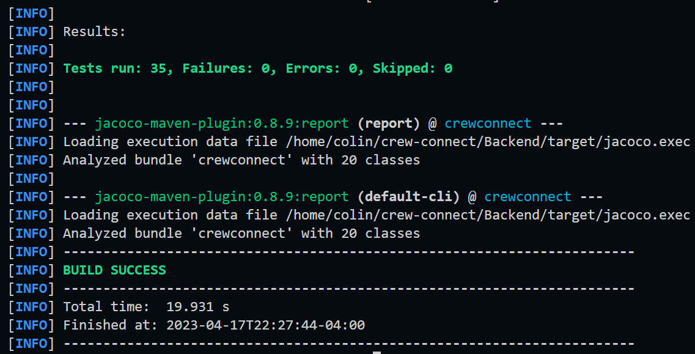
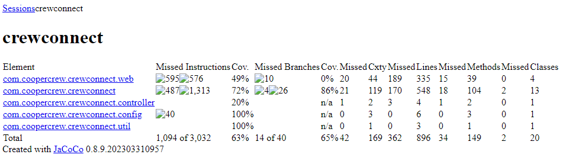

# Crew Connect

Crew Connect is the ultimate communication platform for crews of all kinds. It's so good, you'll want to bring your entire crew onto the platform, even your grandma who still uses a flip phone. With features that allow you to easily communicate and collaborate with your team members, you'll be able to slay the competition and get work done like a boss. 

## How to Run
Using Docker, the server can be run be running `$ docker compose build` and `$ docker compose up` in the main directory. Be sure to change the directory of the database in the `$ docker-compose.yaml` file to where it is located on your computer (we were having issues using `$HOME` for some raeson). Also, make sure that the hostname is set to `db` if that is the case. The server can also be run using java by running `$ maven package` in the main directory. In this case, make sure that hostname is set to `localhost`. It should produce a `jar` file in target that can be run using the JVM by invoking it using `java -jar {filename}.jar`. Note that the database must be running if ran this way. The database does not automatically create itself as well, sql scripts in the `db-materials/` can be used in order to do so. To use the client (`src/client/client.py`), make sure that the url of the hostname is proper to the situation. If run locally this must be set to localhost. In the example given, it was the url of the server that the spring boot instance was running on during the demo. 

## Crew Connect is Now Hosted
You can now connect to our crew connect application on http://142.93.251.255:3000/ instead of running it locally!

## Unit Test Coverage

Here are the results of our unit testing that ensure that our service is reliable and works as expected:

Proof of tests passing:

Code coverage - 62%:

## Getting Started

To use Crew Connect, you'll first need to muster up the courage to create an account. Once you've done that, you can create or join a crew. When you create a crew, you'll be given a unique invite link that you can share with your crew members. This will get them excited about using the platform, and they'll start hyping you up like you're the coolest person they know.

## Features Coming Soon

We're still working on some of the features, but we promise they're worth the wait:

- Screen Sharing: Coming soon! We know it's important to see what your teammates are doing, but for now, just imagine them working really hard.
- File Sharing: Coming soon! We're still figuring out how to make this feature work, but in the meantime, why not try sharing files the old-fashioned way? You know, by attaching them to an email.
- Emojis and Reactions: Coming soon! We know how much you love to express yourself with emojis, and we can't wait to see the creative ways you'll use them on Crew Connect.

## Pricing

Crew Connect is free to use, because we know you're broke from spending all your money on gaming chairs and energy drinks. There are no fees for creating or joining a crew, and all features are available to all users.

## Security

Crew Connect does not take security seriously, because we know how not important it is to keep your conversations private. All communication between users is not encrypted to ensure that messages and files are not protected from unauthorized access. Additionally, Crew Connect doesn't allows users to report and block other users who violate the platform's terms of service.

## Support

If you have any questions or issues with Crew Connect, you can contact our support team, who will try their best to help you. If they can't, they'll just send you some funny memes to cheer you up. You can reach us at support@crew-connect.com. We can't wait to hear from you, even if you're just calling to say hi!

## Ethics: OUR STRONG ETHICAL STANDARDS
- 1.06. Be fair and avoid deception in all statements, particularly public ones, concerning software or related documents, methods and tools.
    - We are fair, and not deceptive, we state in our main readme.md that the app is not secure, and do not try to give the illusion of security.
- 2.02. Not knowingly use software that is obtained or retained either illegally or unethically.
    - We only use packages and software that we have the proper licensing for. 
- 5.11. Not ask a software engineer to do anything inconsistent with this Code.
    - Not only have we not asked any software enginner to do anything inconsistent with this code, we have actually encoranged following the code, by writing this document
- 6.02. Promote public knowledge of software engineering.
    - By Open Sourcing our project we are promoting public knowledge of software enginnering
- 6.10. Avoid associations with businesses and organizations which are in conflict with this code.
    - Crew Connect *strongly* dis-associates from businesses and organizations which are in conflict our high ethical standards, which are much higher than the ACM Code.
- 7.01. Encourage colleagues to adhere to this Code.
    -  Here, we memebers of Crew Connect *strongly*, and *passionately* encourage our colleagues to adhere to the ACM Code.
- 7.08. In situations outside of their own areas of competence, call upon the opinions of other professionals who have competence in that area.
    -  There are several times throughout this project in which we have called upon the opinions of other professionals, especially CHAT-GPT and [Gary Kim](https://garykim.dev). 
-  8.03. Improve their ability to produce accurate, informative, and well-written documentation.
    - We at crew connect have taken many steps to learn about and produce accurate, informative, and well-written documentation, that explains our code. We have *even* utilized tools such as postman to help with creating simple to read documentation 
- 8.07 Not give unfair treatment to anyone because of any irrelevant prejudices.
    - We do not treat anyone unfairly, even civies, because of any irrelevant prejudices - we even support civies in software!
- 8.08. Not influence others to undertake any action that involves a breach of this Code.
    - We have never, and will never pay anyone to take an action (or in-action) that would result in a breach of this code
- 8.09. Recognize that personal violations of this Code are inconsistent with being a professional software engineer.
    - We at CREWCONNECT recognize that personal violations of this ACM CODE OF ETHICS are inconsistent with being a professional software engineer, and we have shown as such by writing about it here.

 

